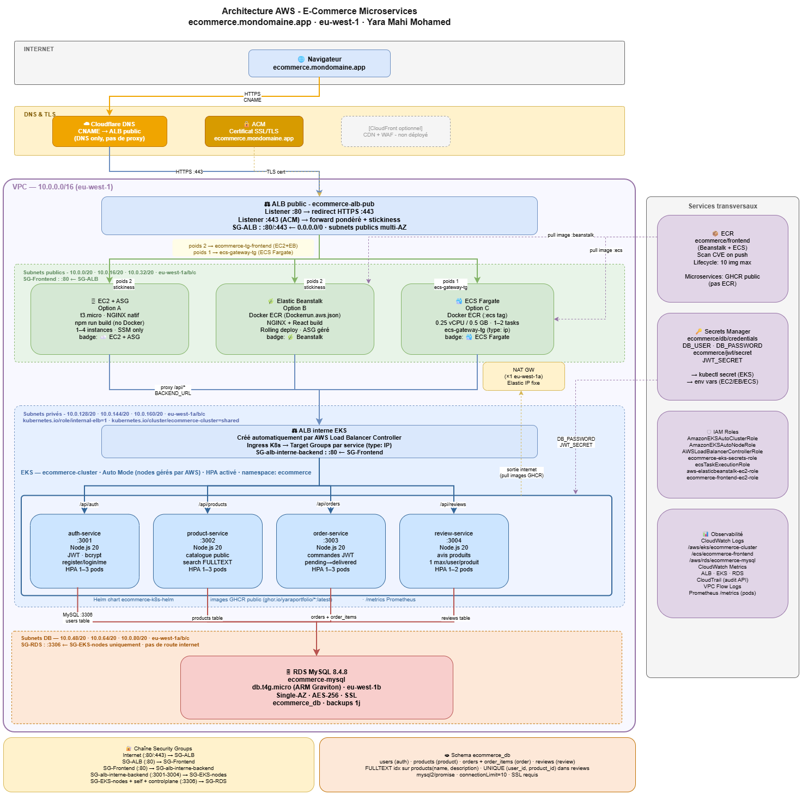
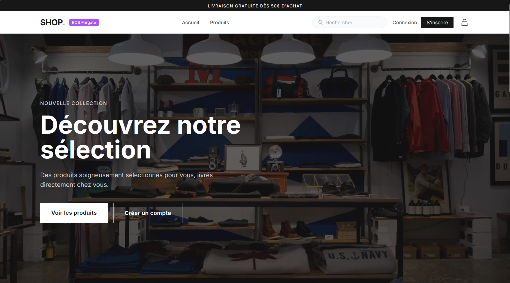
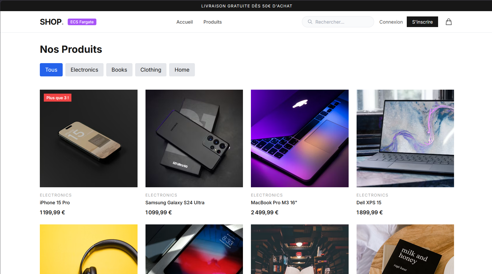
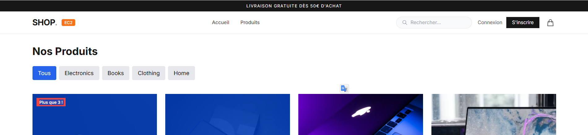
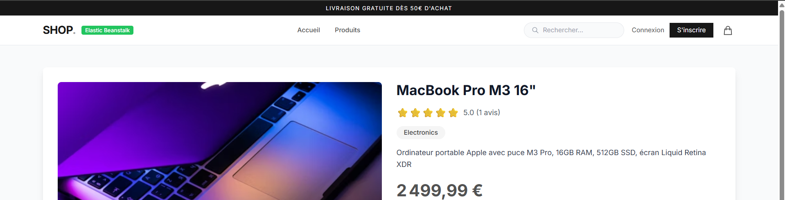
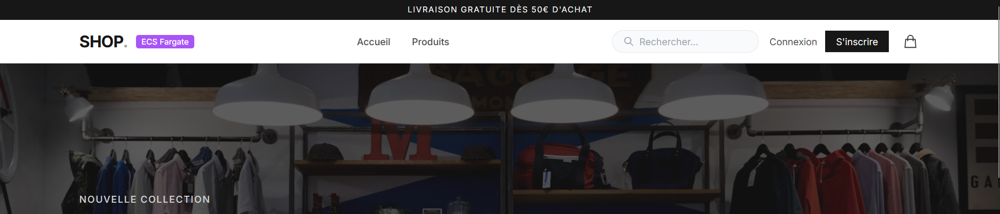
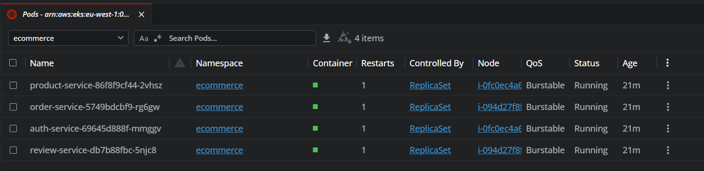
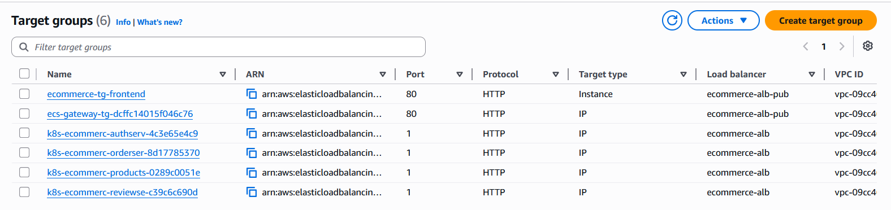
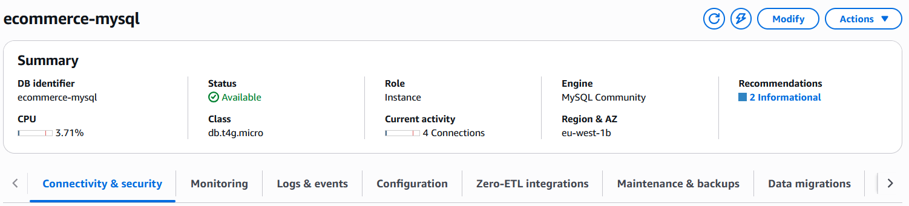

# ☁️ AWS E-Commerce - Infrastructure & Déploiement Multi-Plateforme


> **Auteur :** Yara Mahi Mohamed - Portfolio DevOps & SRE
> **Stack :** React 18 + NGINX · Node.js 20 (4 microservices) · RDS MySQL 8.4 · EKS Auto Mode + Helm
> **Région :** `eu-west-1` (Irlande) · **Domaine :** [ecommerce.mondomaine.app](https://ecommerce.mondomaine.app)

Déploiement d'une plateforme e-commerce microservices sur AWS, avec le **frontend déployé de 3 façons différentes** (EC2, Elastic Beanstalk, ECS Fargate) pour illustrer la progression IaaS → PaaS → Serverless. Un badge dynamique dans la navbar indique en temps réel sur quelle plateforme tourne l'instance servie.

---

## 🗺️ Architecture

```
Internet → Cloudflare DNS (ecommerce.mondomaine.app)
                  │ HTTPS
        ┌─────────▼──────────┐
        │  ALB public (443)  │  ecommerce-alb-pub
        └─────────┬──────────┘
      stickiness  │  forward pondéré
        ┌─────────┼──────────────────┐
        ▼         ▼                  ▼
   EC2 (NGINX)  Beanstalk        ECS Fargate
   Option A     Option B          Option C
   badge EC2    badge Beanstalk   badge ECS
        └─────────┼──────────────────┘
                  │ /api/* (proxy NGINX)
        ┌─────────▼──────────┐
        │ ALB interne EKS    │  internal-ecommerce-alb (privé)
        └─────────┬──────────┘
   ┌──────┬───────┼────────┬─────────┐
   ▼      ▼       ▼        ▼
 auth  product  order   review        (EKS Auto Mode + Helm + HPA)
 :3001  :3002   :3003   :3004
   └──────┴───────┼────────┴─────────┘
                  │ MySQL :3306
        ┌─────────▼──────────┐
        │  RDS MySQL 8.4     │  ecommerce-mysql
        └────────────────────┘
```

> 📐 Architecture détaillée, décisions techniques et correspondances OCI→AWS : **[docs/ARCHITECTURE.md](./docs/ARCHITECTURE.md)**

<!-- L'image ci-dessous s'affichera dès que img/architecture.png sera ajouté -->


---

## 📸 Galerie

> Les images apparaissent automatiquement dès que les captures sont déposées dans [`img/`](./img/).

<table>
  <tr>
    <td align="center"><strong>Page d'accueil</strong><br></td>
    <td align="center"><strong>Catalogue produits</strong><br></td>
  </tr>
  <tr>
    <td align="center"><strong>Badge EC2</strong><br></td>
    <td align="center"><strong>Badge Elastic Beanstalk</strong><br></td>
  </tr>
  <tr>
    <td align="center"><strong>Badge ECS Fargate</strong><br></td>
    <td align="center"><strong>Pods EKS (Lens)</strong><br></td>
  </tr>
  <tr>
    <td align="center"><strong>ALB - targets healthy</strong><br></td>
    <td align="center"><strong>RDS MySQL</strong><br></td>
  </tr>
</table>

---

## 📚 Documentation

| Guide | Description |
|-------|-------------|
| 📐 [docs/ARCHITECTURE.md](./docs/ARCHITECTURE.md) | Architecture détaillée, décisions techniques, flux de données, coûts |
| 🖱️ [docs/GUIDE-CONSOLE-AWS.md](./docs/GUIDE-CONSOLE-AWS.md) | Déploiement pas à pas via la **console AWS** (interface web) |
| ⌨️ [docs/GUIDE-DEPLOIEMENT-MANUEL.md](./docs/GUIDE-DEPLOIEMENT-MANUEL.md) | Déploiement via **CLI** (aws, kubectl, helm) |
| 🏗️ [terraform/](./terraform/) | Infrastructure as Code (Phase 2 - Terraform modulaire) |

---

## 🔗 Projets liés

| Composant | Repository | Rôle |
|-----------|-----------|------|
| 🎨 Frontend React | [ecommerce-frontend](https://github.com/yaraportfolio/ecommerce-frontend) | SPA React + NGINX, badge plateforme |
| ⎈ Helm Chart | [ecommerce-k8s-helm](https://github.com/yaraportfolio/ecommerce-k8s-helm) | Déploiement Kubernetes des microservices |
| 🔐 Auth Service | [ecommerce-auth-service](https://github.com/yaraportfolio/ecommerce-auth-service) | Authentification JWT (`:3001`) |
| 📦 Product Service | [ecommerce-product-service](https://github.com/yaraportfolio/ecommerce-product-service) | Catalogue produits (`:3002`) |
| 🛒 Order Service | [ecommerce-order-service](https://github.com/yaraportfolio/ecommerce-order-service) | Gestion commandes (`:3003`) |
| ⭐ Review Service | [ecommerce-review-service](https://github.com/yaraportfolio/ecommerce-review-service) | Avis produits (`:3004`) |

---

## 🚀 Déploiement rapide

Deux approches, même architecture :

### Option 1 - Console AWS (recommandé pour apprendre)

Suivre **[docs/GUIDE-CONSOLE-AWS.md](./docs/GUIDE-CONSOLE-AWS.md)** - chaque étape indique le chemin exact dans la console (`Service → Sous-menu → Bouton`).

Ordre : VPC → Security Groups → RDS → Secrets Manager → ECR → EKS → ALB public → Frontend (EC2/Beanstalk/ECS) → CloudFront (optionnel).

### Option 2 - Terraform (Phase 2)

State **local** (portfolio) - aucun backend S3/DynamoDB à provisionner.

```bash
# Se placer dans l'environnement de prod
cd terraform/environments/prod

# Télécharger les providers (AWS, Kubernetes, Helm, TLS) — une seule fois
terraform init

# --- Valeurs propres à ton compte (jamais en clair dans un fichier versionné) ---
export TF_VAR_db_password="••••••"                                             # mot de passe RDS
export TF_VAR_jwt_secret="••••••••••••••••••••••••••••••••"                    # secret JWT partagé
export TF_VAR_certificate_arn="arn:aws:acm:eu-west-1:ACCOUNT:certificate/XXXX" # TON certificat ACM (eu-west-1)
export TF_VAR_frontend_mode="ec2"                                             # ec2 | beanstalk | ecs

# (Optionnel) Prévisualiser ce qui sera créé/modifié, sans rien appliquer
terraform plan

# 1er apply : monte toute l'infra (VPC, EKS, RDS, ALB, frontend…)
# → tape "yes" pour confirmer
terraform apply

# 2e apply : propage le DNS de l'ALB interne (créé en asynchrone par le LBC)
# vers le frontend. C'est son seul effet (voir la note ⚠️ ci-dessous).
terraform apply
```

> ⚠️ **Deux `apply` sont nécessaires.** L'ALB **interne** EKS est créé de façon asynchrone par l'AWS Load Balancer Controller après le déploiement Helm. Le 1er `apply` monte toute l'infra ; le 2e propage automatiquement le **DNS de l'ALB interne** (lu depuis l'Ingress) vers le frontend (`backend_url`). C'est le seul effet du second passage.

Switcher de plateforme frontend sans tout recréer (un seul mode actif à la fois) :

```bash
terraform apply -var="frontend_mode=beanstalk"
terraform apply -var="frontend_mode=ecs"
```

#### ✅ Ce que Terraform fait automatiquement
VPC / subnets / NAT / routes · Security Groups (+ règle RDS←EKS) · RDS MySQL + secrets · EKS Auto Mode + add-ons + LB Controller · microservices (Helm, secrets via CSI/IRSA) · ALB public + listeners + stickiness · les **3 frontends** (EC2 natif, Beanstalk avec image ECR, ECS Fargate **TG IP**) **enregistrés tout seuls** dans l'ALB · ECR · DNS de l'ALB interne propagé au frontend.

#### 🖐️ Actions manuelles restantes (non automatisables proprement)

| Action | Quand | Pourquoi pas dans Terraform |
|--------|-------|------------------------------|
| **Certificat ACM** + validation DNS | avant `apply` | Demander le cert ACM et le valider via un enregistrement DNS **Cloudflare** (compte externe). Passer l'ARN dans `TF_VAR_certificate_arn`. |
| **DNS Cloudflare** : CNAME `domaine → ALB public` | après `apply` | Cloudflare est **externe** au Terraform (nécessiterait un token API). |
| **Build + push de l'image `ecommerce/frontend` sur ECR** | avant les modes `beanstalk`/`ecs` | Artefact applicatif (`docker build && push`) - relève du CI/CD, pas de l'infra. *(Le mode `ec2` n'en a pas besoin : build natif sur la VM.)* |
| **Import du schéma `ecommerce_db.sql`** | après `apply` | RDS est privé (pas d'accès depuis votre poste) → via un bastion ou SSM, une seule fois. Ce sont des **données**, pas de l'infra. |
| **Sauvegarde de `terraform.tfstate`** | après chaque `apply` | Inhérent au state local : un simple `cp` ailleurs (le fichier contient les secrets, ne pas le committer). |

> ℹ️ Tout le reste (IAM, Security Groups, IP publiques, réseau, enregistrement dans les Target Groups) est **entièrement géré par Terraform**.

---

## 🧩 Les 3 modes de déploiement frontend

| | Option A - EC2 | Option B - Beanstalk | Option C - ECS Fargate |
|--|----------------|----------------------|------------------------|
| **Modèle** | IaaS | PaaS | Serverless containers |
| **Runtime** | NGINX natif (build direct) | Docker (ECR) | Docker (ECR) |
| **Gestion OS** | Manuelle | AWS | Aucune (pas de VM) |
| **Scale to zero** | Non | Non | Oui |
| **Coût (stable)** | Le moins cher | = EC2 | Le plus cher |
| **Badge navbar** | 🟠 EC2 | 🟢 Beanstalk | 🟣 ECS Fargate |

Le badge est piloté par la variable **build-time** `VITE_DEPLOY_PLATFORM` (intégrée au build React).

---

## 🔐 Sécurité

- Secrets DB/JWT dans **AWS Secrets Manager** (jamais en clair, jamais committés)
- **IRSA** (IAM Roles for Service Accounts) via OIDC - pas de credentials AWS dans les pods
- Chaîne de **Security Groups** : Internet → ALB public → Frontend → ALB interne EKS → microservices → RDS
- RDS isolé en subnets privés, accessible uniquement depuis les nœuds EKS
- Chiffrement au repos (RDS) + SSL en transit
- Accès aux instances via **SSM Session Manager** (zéro port SSH ouvert)

---

## 🔄 Correspondances OCI → AWS

| OCI | AWS | Note |
|-----|-----|------|
| VCN | VPC | Régional |
| Compartment | Account / Tags | Isolation logique |
| OCR | ECR | Registry Docker |
| OKE | EKS (Auto Mode) | Kubernetes managé |
| Autonomous DB / DBCS | RDS MySQL 8.4 | Compatible MariaDB 10.11 |
| Load Balancer | ALB | Application Load Balancer (L7) |
| Security List / NSG | Security Group | AWS SG stateful |

---

*Portfolio DevOps & SRE - démontre VPC multi-AZ, EKS, Helm, IRSA, multi-registry (GHCR + ECR), et 3 modèles de déploiement applicatif sur AWS.*
